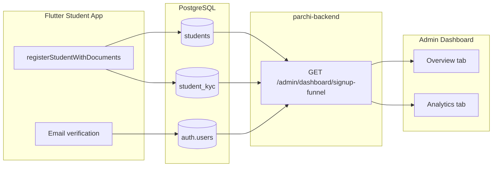

# Signup Dropoff Audit

**Date:** June 2026  
**Status:** Decisions locked; Option B+ implemented  
**Repos:** `parchi-backend`, `Parchi_PWA_/dashboards`, `Parchi-Flutter`

---

## Executive Summary

The admin dashboard had **two competing signup funnels** with different semantics. The Analytics tab chart ("Detailed Signup Drop-off") counted **raw app event logs** and labeled them as "Users." The Overview tab ("Signup Dropoff Analysis") counted **unique students from database records.**

**Verdict:** The event-based chart was **not accurate** for unique-user conversion. The DB-state funnel is now the **single source of truth** for signup dropoff KPIs.

---

## Product Decisions (Locked)

| Question | Decision |
|----------|----------|
| Source of truth | **DB-state funnel** (`GET /admin/dashboard/signup-funnel`) |
| Goal | **Unique-user conversion** |
| "Complete" definition | **Server-side account creation** (after `registerStudentWithDocuments`) |
| Platform scope | **Mobile only** (Flutter student app) |
| Date range | **All-time** (no date filter on funnel for v1) |
| Verification event | **Fix instrumentation** — `signup_verification_sent` once per signup attempt |

---

## Authoritative Funnel Stages

Counts are **unique students** derived from database state (all-time).

| # | Stage | Meaning |
|---|-------|---------|
| 1 | **Documents Submitted** | App signup complete — `student_kyc` + identity docs + selfie |
| 2 | Email Verified | Step 1 + confirmed email |
| 3 | Submitted for KYC | Step 2 + in review queue |
| 4 | KYC Approved | Fully approved |

**Chart display order (top → bottom):** Documents Submitted → Email Verified → Submitted for KYC → KYC Approved

Each stage is a **nested subset** of the previous. There is no separate "Account Created" vs "Documents Submitted" — splitting them caused fake ~88% drop-offs.

**Exits** (returned by API per stage):

```
exits = previousStage.count - currentStage.count   (0 for stage 1)
dropoffPct = exits / previousStage.count × 100
percentOfTotal = currentStage.count / registered × 100
```

**Out of scope:** Pre-registration abandoners (opened signup form, never submitted documents) — invisible by design.

---

## What Was Wrong Before

### Event-based funnel (deprecated for KPI)

- Backend: `AnalyticsService.getOnboardingDropoff()` — `COUNT(*)` on `analytics_events` by `event_name`
- Frontend: Analytics tab `admin-analytics.tsx` — "Detailed Signup Drop-off" area chart
- Problems:
  - Counted **events**, not unique users
  - `signup_verification_sent` fired on **every screen reopen**
  - `signup_step_1_complete` fired on **local validation only** (no server account)
  - Pre-auth events had **null `user_id`** — no deduplication possible
  - UI said "1,789 Users" when it meant event fires

### Old DB funnel (7 stages, wrong order)

Previous `getSignupDropoff()` used 7 stages with email verify before documents and separate ID/selfie counts. Replaced with 5 stages aligned to the real mobile signup flow.

---

## Architecture (Current)

```
Flutter app                    Backend                         Admin dashboard
─────────────                  ───────                         ───────────────
signup screens        →   POST /analytics/log          →   (debug events only)
registerStudent...    →   students + student_kyc rows  →   GET /signup-funnel
email confirm         →   auth.users.email_confirmed   →   Overview + Analytics tabs
```



---

## Implementation Changes

### Backend (`parchi-backend`)

- **`AdminDashboardService.getSignupDropoff()`** — rewritten with 5 stages (see table above)
- **`getDashboardStats()`** — removed `onboardingDropoff` from response (no longer fetched)
- **`AnalyticsService.getOnboardingDropoff()`** — marked `@deprecated`; kept for reference

### Admin dashboard (`Parchi_PWA_/dashboards`)

- **`admin-analytics.tsx`** — Detailed Signup Drop-off now uses `signupFunnel` from `GET /signup-funnel` (same data as Overview)
- **`admin-dashboard.tsx`** — passes `funnelData` into `AdminAnalytics`
- Copy updated: "unique students", "database records", removed misleading verification-spike note

### Flutter (`Parchi-Flutter`)

- **`sign_form.dart`** — removed `signup_step_1_complete` (was firing before server account creation)
- **`signup_verification_screen.dart`** — `signup_verification_sent` logged once per email per signup attempt
- **`signup_draft_service.dart`** — `hasLoggedVerificationSent` / `markVerificationSentLogged` / `clearVerificationSentFlag`

---

## Event Reference (Debug Only)

Events still POST to `/analytics/log` but are **not** used for signup dropoff KPIs.

| Event | When fired |
|-------|------------|
| `signup_step_1_start` | Step 1 form opens |
| `signup_step_2_start` | Document upload screen opens |
| `signup_step_2_complete` | After successful `registerStudentWithDocuments` |
| `kyc_submitted` | Same as step 2 complete |
| `signup_verification_sent` | First load of verification screen per email (deduped) |
| `signup_verification_verified` | Email confirmed |
| `signup_completed` | Same as verified |

---

## Validation Queries

Run against staging/production to sanity-check funnel monotonicity (each stage ≤ previous):

```sql
-- Stage counts (approximate — use API for canonical numbers)
SELECT 'account_created' AS stage, COUNT(*) AS cnt FROM students
UNION ALL
SELECT 'documents_submitted', COUNT(*) FROM student_kyc
  WHERE selfie_image_path <> ''
    AND (student_id_card_front_path IS NOT NULL OR cnic_front_image_path IS NOT NULL)
UNION ALL
SELECT 'email_verified', COUNT(DISTINCT s.id)
  FROM students s
  JOIN auth.users u ON u.id = s.user_id
  WHERE u.email_confirmed_at IS NOT NULL
UNION ALL
SELECT 'kyc_pending', COUNT(*) FROM students WHERE verification_status = 'pending'
UNION ALL
SELECT 'kyc_approved', COUNT(*) FROM students WHERE verification_status = 'approved';

-- Event vs unique-user distortion (legacy — should not be used for KPI)
SELECT event_name,
       COUNT(*) AS total_events,
       COUNT(DISTINCT user_id) AS unique_user_ids
FROM analytics_events
WHERE event_name LIKE 'signup_%'
GROUP BY event_name
ORDER BY event_name;
```

---

## API Reference

### `GET /admin/dashboard/signup-funnel`

**Auth:** Admin JWT

**Response:**

```json
{
  "stages": [
    {
      "stage": "Account Created",
      "count": 2000,
      "percentOfTotal": 100,
      "dropoffPct": 0
    },
    {
      "stage": "Documents Submitted",
      "count": 1980,
      "percentOfTotal": 99,
      "dropoffPct": 1
    }
  ]
}
```

### `GET /admin/dashboard/stats`

Still returns `funnelStats` (acquisition events: app opens, redemptions) for the **Acquisition Funnel** bar chart. Does **not** return `onboardingDropoff`.

---

## Key Files

| Layer | Path |
|-------|------|
| Funnel query | `src/modules/admin-dashboard/admin-dashboard.service.ts` |
| Funnel endpoint | `src/modules/admin-dashboard/admin-dashboard.controller.ts` |
| Deprecated events | `src/modules/analytics/analytics.service.ts` |
| Analytics tab UI | `Parchi_PWA_/dashboards/components/admin-analytics.tsx` |
| Overview tab UI | `Parchi_PWA_/dashboards/components/admin-dashboard.tsx` |
| API client types | `Parchi_PWA_/dashboards/lib/api-client.ts` |
| Verification dedupe | `Parchi-Flutter/.../signup_draft_service.dart` |

---

## Future Considerations

- **Date filtering** on funnel if product needs cohort analysis
- **Pre-registration metric** via session-deduped `signup_step_1_start` (separate card, not mixed into DB funnel)
- **Rejected KYC** students appear as drop-off between KYC Pending and KYC Approved (by design)
