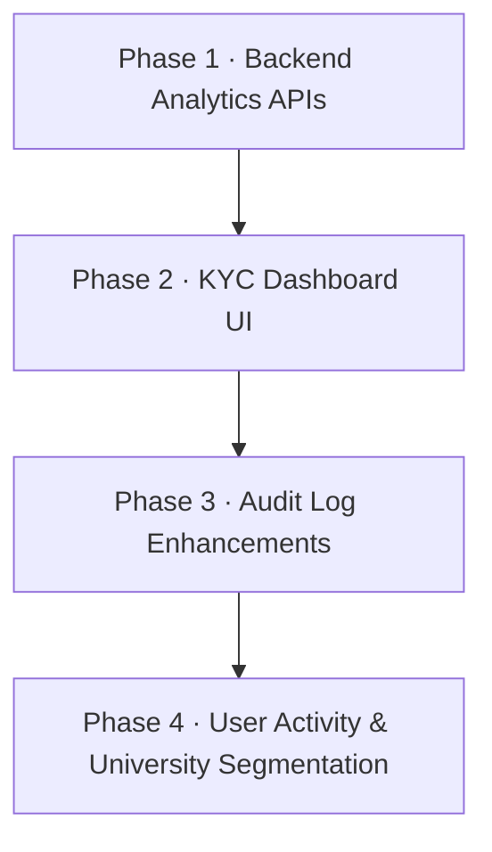

# Development Plan: KYC Analytics, Audit Logs & User Segmentation

> **Scope:** `parchi-backend` (NestJS/Prisma) + `Parchi_PWA_/dashboards` (Next.js/React)  
> **Total Features:** 8  
> **Estimated Complexity:** Medium–High

---

## Overview



---

## Phase 1 — Backend: KYC Analytics & Stats Endpoints

### Feature 1.1 — Rejection Reason in "Rejected List" (Backend)

**What:** Expose `review_notes` from `student_kyc` in the existing student list API so the frontend can render it inline.

**Data model:** `student_kyc.review_notes` already exists (see schema line 602). The latest KYC record holds the reason.

**Files to change:**
| File | Change |
|---|---|
| `src/modules/students/students.service.ts` | Already includes `reviewNotes` in the student detail mapper (line 1129/1191). Verify it is also included in the **list** response (`getAllStudents`). If not, add `latestKyc.review_notes` to the list mapper. |
| `src/modules/students/dto/student-response.dto.ts` | Confirm `reviewNotes: string \| null` field is present in the list DTO — add if missing. |

**New endpoint:** None required. Piggyback on the existing `GET /students` (filtered by `status=rejected`).

---

### Feature 1.2 — Rejection Stats Grouped by Student Type & Reason (Backend)

**What:** New endpoint `GET /admin/dashboard/kyc-rejection-stats` returning:
```json
{
  "byReason": [{ "reason": "Blurry ID", "count": 14 }],
  "byUniversity": [{ "university": "LUMS", "rejectedCount": 5 }],
  "mostFoundIssue": "Blurry ID",
  "totalRejected": 43
}
```

**Files to change:**
| File | Change |
|---|---|
| `src/modules/admin-dashboard/admin-dashboard.service.ts` | Add private `getKycRejectionStats()` method. Uses `prisma.student_kyc.groupBy(['review_notes'])` for reason breakdown and a join with `students` for university breakdown. Call it inside `getDashboardStats()`. |
| `src/modules/admin-dashboard/admin-dashboard.controller.ts` | Add `@Get('kyc-rejection-stats')` route handler. |
| `src/modules/admin-dashboard/dto/dashboard-stats-response.dto.ts` | Add `kycRejectionStats` field to the response DTO. |

**Key query logic:**
```typescript
// In admin-dashboard.service.ts
private async getKycRejectionStats() {
  const rejectedStudents = await this.prisma.students.findMany({
    where: { verification_status: 'rejected' },
    include: {
      student_kyc: {
        orderBy: { created_at: 'desc' },
        take: 1,
        select: { review_notes: true }
      }
    }
  });

  // Group by review_notes (rejection reason)
  const reasonCounts = new Map<string, number>();
  for (const s of rejectedStudents) {
    const reason = s.student_kyc[0]?.review_notes ?? 'No reason provided';
    reasonCounts.set(reason, (reasonCounts.get(reason) ?? 0) + 1);
  }

  const byReason = [...reasonCounts.entries()]
    .map(([reason, count]) => ({ reason, count }))
    .sort((a, b) => b.count - a.count);

  return {
    totalRejected: rejectedStudents.length,
    byReason,
    mostFoundIssue: byReason[0]?.reason ?? null,
  };
}
```

---

### Feature 1.3 — Active User Tracking (7-day & 30-day) (Backend)

**What:** New method in `admin-dashboard.service.ts` computing active users by checking `redemptions.created_at` (students who redeemed) or `audit_logs.created_at` (admin actions) within the windows.

**Files to change:**
| File | Change |
|---|---|
| `src/modules/admin-dashboard/admin-dashboard.service.ts` | Add `getActiveUserTracking()` — queries `redemptions` grouped by `created_at` date bucketed over 7d and 30d. |
| `src/modules/admin-dashboard/admin-dashboard.controller.ts` | Add `@Get('active-users')` with optional `?window=7d\|30d` query param. |

**Data returned:**
```json
{
  "last7Days": { "uniqueStudents": 120, "totalRedemptions": 345, "dailyBreakdown": [...] },
  "last30Days": { "uniqueStudents": 480, "totalRedemptions": 1200, "dailyBreakdown": [...] }
}
```

---

### Feature 1.4 — University Percentage & Granular Histogram (Backend)

**What:** The current `getUniversityDistribution()` already computes percentage (line 238–242 in `admin-dashboard.service.ts`). Extend it to also return segmentation by `city` using the student's university info, and add a filter param.

**Files to change:**
| File | Change |
|---|---|
| `src/modules/admin-dashboard/admin-dashboard.service.ts` | Modify `getUniversityDistribution()` to accept optional `groupBy: 'university' \| 'city'` param. For `city`, join with institutes or use stored `university` field. |
| `src/modules/admin-dashboard/admin-dashboard.controller.ts` | Add `?groupBy=city` query param to `GET /admin/dashboard/stats` or a new `GET /admin/dashboard/student-segmentation` endpoint. |

---

### Feature 1.5 — Audit Log Category Separation (Backend)

**What:** Currently `APPROVE_REJECT_STUDENT` is a single action. Split into `APPROVE_STUDENT` and `REJECT_STUDENT` at the audit write point. Also add `category` field to audit log query DTO.

**Files to change:**
| File | Change |
|---|---|
| `src/modules/students/students.service.ts` | At the `approveReject` call site (around line 926), write `APPROVE_STUDENT` when `action === 'approve'` and `REJECT_STUDENT` when `action === 'reject'`. |
| `src/modules/audit/dto/query-audit-logs.dto.ts` | Add `category?: 'accept' \| 'reject'` field. Map to action filter: `accept → APPROVE_*`, `reject → REJECT_*`. |
| `src/modules/audit/audit.service.ts` | In `getAuditLogs()`, translate the `category` filter into an `action { in: [...] }` Prisma clause. |

> [!WARNING]
> This is a **breaking rename** for existing audit log records. Consider **keeping the old action** for historical records and only writing the new format for future records. The filter logic should match both old (`APPROVE_REJECT_STUDENT` where `newValues.verificationStatus === 'approved'`) and new (`APPROVE_STUDENT`) values.

---

## Phase 2 — Frontend: KYC Dashboard UI

### Feature 2.1 — Rejection Reason Inline in Rejected List

**Files to change:**
| File | Change |
|---|---|
| `components/admin-kyc.tsx` | In the `All Students` table (line 654+), when `student.verificationStatus === 'rejected'`, render a `<span>` or `<Badge>` below the KYC Status badge showing `student.reviewNotes`. Add a tooltip for long notes. |
| `lib/api-client.ts` | Ensure `Student` type includes `reviewNotes: string \| null` in the list response shape (already present at line 905 for detail — confirm it's in the list shape too). |

**UI detail:**
```tsx
{student.verificationStatus === 'rejected' && student.reviewNotes && (
  <div className="text-xs text-red-500 mt-1 max-w-[200px] truncate" title={student.reviewNotes}>
    ↳ {student.reviewNotes}
  </div>
)}
```

---

### Feature 2.2 — KYC Rejection Analytics Panel

**Files to change:**
| File | Change |
|---|---|
| `components/admin-kyc.tsx` | Add a new "Analytics" tab (alongside "Pending" and "All Students"). |
| `lib/api-client.ts` | Add `getKycRejectionStats()` function calling `GET /admin/dashboard/kyc-rejection-stats`. |
| `hooks/use-kyc.ts` | Add `useKycRejectionStats()` hook. |

**New Analytics Tab UI includes:**
- **"Most Found Issue"** card (large prominent stat card with the top rejection reason)
- **Rejection by Reason** bar chart (using existing Recharts setup)
- **Rejection by University** horizontal bar chart
- **Total Rejected** count card

---

## Phase 3 — Frontend: Audit Log Enhancements

### Feature 3.1 — Accept/Reject as Separate Filterable Categories

**Files to change:**
| File | Change |
|---|---|
| `components/admin-audit-logs.tsx` | Replace the current action dropdown (line 206–213) with a **two-tier filter**: "Category" (All / Accept Actions / Reject Actions) + "Action" (specific action type). Pass `category` param to API. |
| `lib/api-client.ts` | Update `AuditLogsQuery` type and `getAuditLogs()` to accept `category?: string`. |

**New filter options:**
```tsx
const categoryFilters = [
  { value: 'all', label: 'All Actions' },
  { value: 'accept', label: '✅ Accept Actions' },
  { value: 'reject', label: '❌ Reject Actions' },
]
```

**Visual treatment:** Accept actions → green badge. Reject actions → red badge. Add colored left-border on table rows to signal the category at a glance.

---

## Phase 4 — Frontend: User Activity & University Segmentation

### Feature 4.1 — Active User Tracking (7-day & 30-day)

**Files to change:**
| File | Change |
|---|---|
| `components/admin-dashboard.tsx` | Add an "Active Users" section below Platform Overview. Show two toggle cards (7d / 30d) with a sparkline or mini bar chart for daily breakdown. |
| `lib/api-client.ts` | Add `getActiveUserTracking()` calling `GET /admin/dashboard/active-users`. |

**UI spec:**
- Two cards side by side: **Last 7 Days** / **Last 30 Days**
- Each card shows: unique students active, total redemptions in window
- Click on a card → expand to show a day-by-day `BarChart` (using existing Recharts setup)

---

### Feature 4.2 — Enhanced University Histogram with Dropdown

**Files to change:**
| File | Change |
|---|---|
| `components/admin-dashboard.tsx` | Wrap the current `<BarChart>` (line 430) in a new sub-component `<UniversitySegmentationChart>`. Add a `<Select>` dropdown at the top: `["By University", "By City"]`. |
| `lib/api-client.ts` | Update `getAdminDashboardStats()` or add `getStudentSegmentation(groupBy)` to support the `groupBy` param. |

**Dropdown UI:**
```tsx
<Select value={groupBy} onValueChange={setGroupBy}>
  <SelectItem value="university">By University</SelectItem>
  <SelectItem value="city">By City</SelectItem>
</Select>
```

---

### Feature 4.3 — University Percentage Contribution Display

**What:** Already partially computed in backend (`percentage` field in `universityDistribution`). Surface this in the frontend.

**Files to change:**
| File | Change |
|---|---|
| `components/admin-dashboard.tsx` | In the bar chart tooltip and/or a table below the chart, show `(count / total * 100)%` alongside the student count. Add a sortable table view of all universities with count + % columns. |

**Formula:** `(studentsFromUni / totalApprovedStudents) × 100` — already computed server-side.

---

### Feature 4.4 — Comprehensive Student Grouping (City, Institution)

**Files to change:**
| File | Change |
|---|---|
| `components/admin-kyc.tsx` | Add a **"Segmentation"** sub-view or extend the existing filter bar to include a "Group by" toggle: University / City. Change the displayed student table to show a grouped summary view when in grouping mode. |
| `lib/api-client.ts` | Support `groupBy` param in `getAllStudents()` or call the new segmentation endpoint. |

---

## Execution Order

```
Phase 1 (Backend) → must be done first
  1.2 KYC Rejection Stats endpoint
  1.3 Active User Tracking endpoint
  1.4 University Segmentation endpoint
  1.5 Audit Action split (APPROVE vs REJECT)
  1.1 Rejection reason in list response (smallest, do first)

Phase 2 (KYC UI) → needs Phase 1.1 + 1.2
  2.1 Inline rejection reason
  2.2 Analytics tab

Phase 3 (Audit UI) → needs Phase 1.5
  3.1 Category filter

Phase 4 (Activity + Segmentation UI) → needs Phase 1.3 + 1.4
  4.1 Active user tracking cards
  4.2 Histogram dropdown
  4.3 Percentage display
  4.4 Grouping controls
```

---

## Key Decisions Needed

> [!IMPORTANT]
> 1. **Audit log backward compatibility:** Should old `APPROVE_REJECT_STUDENT` records be migrated, or should the filter UI handle both old and new action strings? Recommend handling both in the filter.
> 2. **Active user definition:** Count students who made at least one redemption? Or all students who logged in? Recommend redemptions as the proxy since login events aren't currently tracked.
> 3. **City segmentation source:** The `students` table has no `city` field — city is on `merchant_branches`. Grouping students by city likely means grouping by the **branch city** where they most often redeem. Confirm this interpretation.
> 4. **New tab vs. panel:** Should KYC Rejection Analytics be a 3rd tab in `admin-kyc.tsx` or a standalone section in the overview dashboard? Recommend a tab within KYC for discoverability.

---

## Files Summary

### Backend (`parchi-backend`)
| File | Type of Change |
|---|---|
| `src/modules/admin-dashboard/admin-dashboard.service.ts` | Add 3 new methods |
| `src/modules/admin-dashboard/admin-dashboard.controller.ts` | Add 2 new routes |
| `src/modules/admin-dashboard/dto/dashboard-stats-response.dto.ts` | Extend DTO |
| `src/modules/students/students.service.ts` | Fix audit action name at rejection point |
| `src/modules/audit/dto/query-audit-logs.dto.ts` | Add `category` field |
| `src/modules/audit/audit.service.ts` | Handle `category` in filter logic |

### Frontend (`Parchi_PWA_/dashboards`)
| File | Type of Change |
|---|---|
| `components/admin-dashboard.tsx` | Add Active Users section, update University chart |
| `components/admin-kyc.tsx` | Add Analytics tab, inline rejection reason |
| `components/admin-audit-logs.tsx` | Add category filter, color-coded rows |
| `lib/api-client.ts` | Add 3 new API functions, update types |
| `hooks/use-kyc.ts` | Add `useKycRejectionStats` hook |
